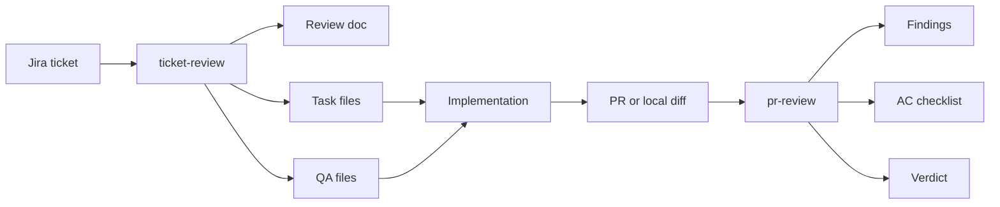
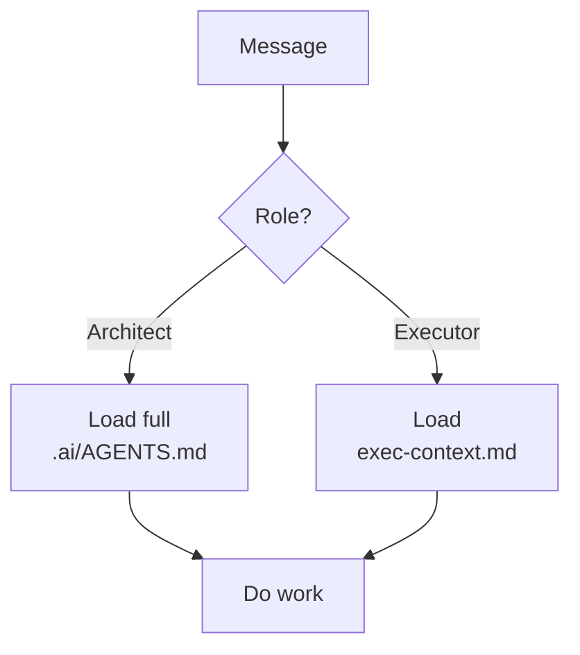
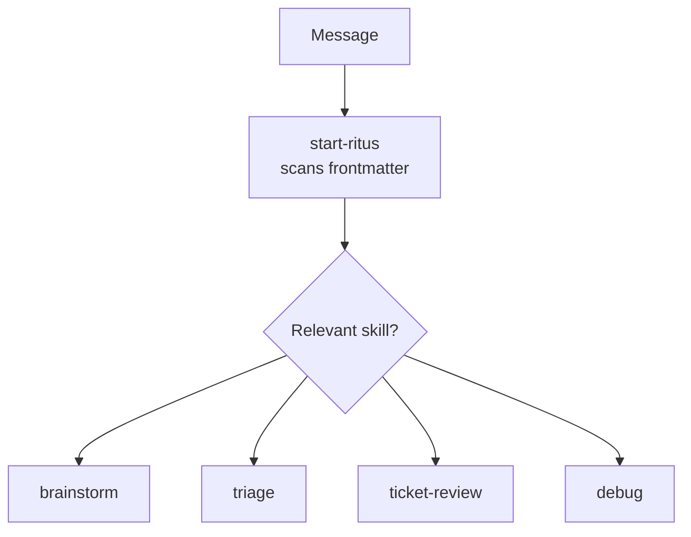
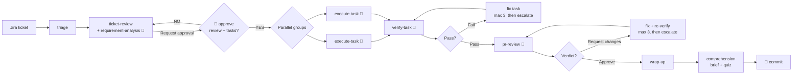
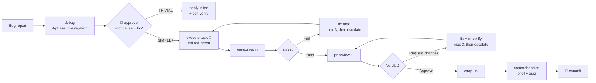
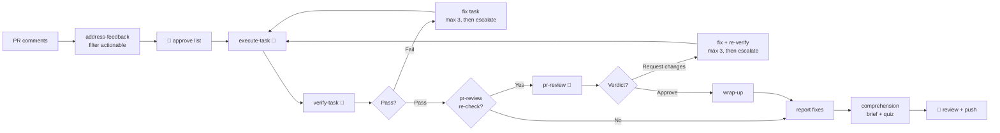
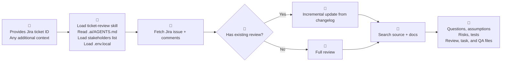
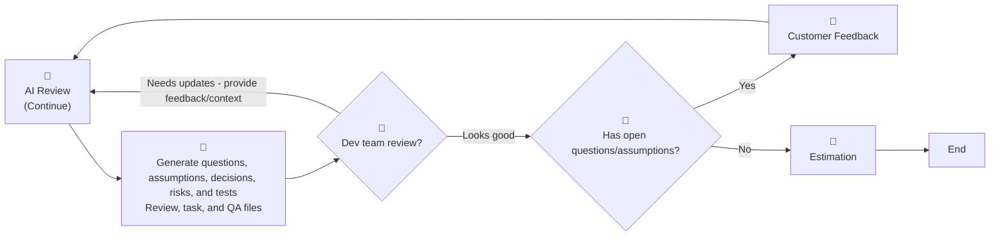
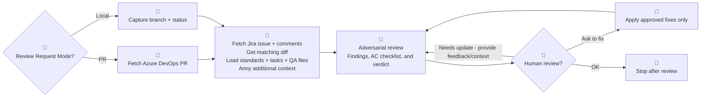
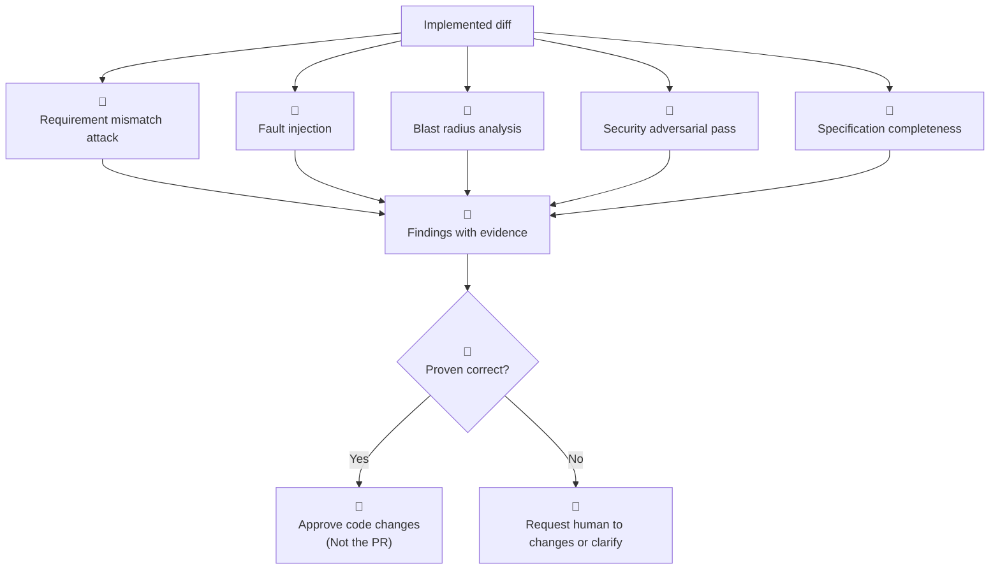

# Workflow v2

## What Changed Since v1

Skill-based architecture, independent verification, and a workflow that runs itself - on rails.

<div class="pt-10 opacity-80">
July 2026
</div>

<!--
This is a delta talk for a team that already knows v1. Lead with what's new, not the basics.
-->

---
layout: image-right
image: /assets/images/why.avif
---

# You Already Know v1

Last time we demoed two Copilot skills - `ticket-review` and `pr-review` - backed by a set of Claude instructions.

That was v1. It worked, and the team adopted it.

Today is not a re-run. Today is **what changed in v2, and why**.

<a href="https://github.com/precise-alloy/ritus" target="_blank">Repository: Ritus</a>

<div class="pt-6 opacity-80">
Kudos to anh Truong and anh Tuyen for their solid foundation.
</div>

<!--
Set expectations: this is a delta talk, not a tutorial. The audience knows the basics.
-->

---
layout: center
class: text-center
---

# What You Saw in v1



Two skills, one handoff. Powerful - but everything around them was still manual. v2 governs the whole chain.

<!--
This slide sets the whole mental model before going into details.
-->

---
layout: section
---

# From v1 to v2

## Same discipline, new engine.


---
layout: two-cols-header
---

# Why Rewrite v1 → v2

::left::

## v1 served us well

- role detection: architect vs executor
- one big `.ai/AGENTS.md` source of truth
- triage, task files, DONE WHEN gates
- standards and doc discipline

::right::

## But it strained

- the monolith loaded every turn - token heavy
- two contexts drift: `AGENTS.md` and `exec-context.md`
- the writer also graded its own work
- Copilot got 2 skills; Claude got the rest

<!--
v1 proved the workflow. v2 fixes how it runs.
-->

---
layout: two-cols-header
---

# What v2 Really Changes

::left::

### One source, every host
Same skills run on Claude Code and Copilot.

### On-demand, not always-on
Skills load only when agents need them. Lean context.

### Independent verification
The agent that writes code is not the one that grades it.

::right::

### TODO-driven control
A single rail the agent can't skip or fall off.

### Portable subagents
Main thread is the only dispatcher - identical everywhere.

<!--
These five points are the whole pitch. Everything after is detail.
-->

---
layout: two-cols-header
---

# Architecture Shift

::left::

## v1 - role-based monolith



One brain, loaded whole, every turn.

::right::

## v2 - on-demand skills



Many small skills, summoned only when relevant.

<!--
The shift: from "which role am I" to "which capability does this need".
-->

---

# The v2 Formula

```text
AI Agent Workflow = Primary rules + Core workflow + Project profile + Runtime context
```

| Layer | Where it lives | What it does |
| ----- | -------------- | ------------ |
| Primary rules | CLAUDE.md / copilot-instructions.md | user's directives - highest authority |
| Core workflow | 20 on-demand skills (plugin) | pure capabilities; main thread dispatches subagents |
| Project profile | `docs/profiles/*.yml` → `PROJECT_CONTEXT.md` | project facts rendered from YAML |
| Runtime context | current task file + active skill | what to work on now |

<div class="pt-4 opacity-80">
Only primary rules and project context are always on. Everything else is summoned.
</div>

<!--
Contrast with v1, where the whole AGENTS.md was always loaded.
-->

---
layout: section
---

# Use Cases

## Three everyday flows, seamless chains.

---
layout: center
class: text-center
---

# Use Case 1 - Feature from a Ticket



Independent tasks fan out in parallel, then converge through verification.

<!--
The parallel fan-out is only safe because each task is verified independently.
-->

---
layout: center
class: text-center
---

# Use Case 2 - Bug Fix



Evidence-graded root cause before any fix. No layering guesses on guesses.

<!--
The 4-phase gate is the real difference from v1's bugfix workflow.
-->

---
layout: center
class: text-center
---

# Use Case 3 - PR Review Comments



Fixes land locally for the human to review - nothing is auto-pushed.

<!--
Human keeps the commit and push. The agent only prepares the change.
-->


---
layout: two-cols-header
---

# Humans Stay in Control

Automation runs the busywork - humans hold the gates.

::left::

### Approve before proceeding
- **Plan** - review the `ticket-review` output before any code
- **Tasks** - approve the execution plan
- **Root cause** - sign off the `debug` investigation and fix
- **Feedback** - pick which PR comments are actionable

::right::

### The final say
- **Diff** - the human reviews every change
- **Understanding** - `comprehension` recaps the change and quizzes you before you commit
- **Commit + push** - nothing lands automatically
- **Escalation** - after 3 fix attempts, the agent stops and asks

<div class="pt-4 opacity-80">
The agent never commits, pushes, or merges on its own.
</div>

<!--
Reassure managers and QA: judgment stays with the team at every gate.
-->

---
layout: section
---

# TODO-Driven Dispatch

## One rail. One dispatcher. Fresh workers.

---
layout: two-cols-header
---

# The Control Loop

::left::

### One rail
The main thread owns a single **TODO** - the control surface. Every skill writes its steps verbatim and marks each one done as it goes.

It walks the list top to bottom; each item is either:

- `invoke <skill>` - run inline
- `dispatch <skill> subagent` - spawn a fresh, isolated worker

::right::

### Report, then apply
A dispatched worker only **reports** a verdict and hand off next action in the chain. The main thread **applies** that update to the TODO and moves on.

> Subagents never spawn subagents.

Only the main thread dispatches, so the workflow runs identically on Claude Code, Copilot, or anywhere.

<!--
The overlap of the old two sections, stated once: the TODO is the surface, dispatch is how items run.
-->

---
layout: two-cols-header
---

# Why It Works

::left::

### Fresh workers
- **Independence** - `verify-task` and `pr-review` cannot rubber-stamp their own work
- **Context isolation** - each worker starts clean, no drift from a long session
- **Parallelism** - independent tasks dispatch at once, then converge

::right::

### The rail
- **Never stops** mid-chain
- **Never skips** a step
- **Always shows** where it is

<div class="pt-6 opacity-80">
Fresh-context quality, plus a visible control surface the agent can't fall off.
</div>

<!--
One story: isolated workers on a single, unskippable rail.
-->

---
layout: section
---

# New in v2

## What the team hasn't seen yet

---
layout: two-cols-header
---

# The New Skills

::left::

- **brainstorm** - explore vague requirements; propose 2-3 approaches before triage
- **requirement-analysis** - read-heavy analysis worker; drafts the review doc
- **verify-task** - independent per-task check in a fresh, isolated subagent
- **debug** - 4-phase root-cause investigation with evidence grading

::right::

- **address-feedback** - turn PR review comments into fix tasks, prepare a local commit
- **wrap-up** - post-review cleanup: promote exploration, verify docs, report status
- **comprehension** - after wrap-up, brief the human and run an advisory quiz on what shipped

<!--
Eleven new skills. Call out verify-task and debug as the biggest wins.
-->

---
layout: center
class: text-center
---

# Conclusion

<div class="text-2xl leading-10 pt-6">
20 skills. One dispatch contract.<br />
Claude Code and Copilot, from a single source.
</div>

<div class="pt-8 opacity-80">
The same discipline you trust - now on rails, independently verified, and portable.
</div>

<!--
Hand off to the live demo or Q&A here.
-->

---
layout: default
---

# What Building This Taught Me

- **Built-in agents are enough** - a generic harness plus injected skills makes the agent the domain expert, no custom agent types needed
- **Don't over-instruct** - models are smart now, lean skills beat micromanaged ones
- **Show, don't tell** - a pointer to a real example or existing pattern beats paragraphs of rules
- **Make the agent prove it** - models are eager to please and will claim success; demand evidence (file:line, command output), not assertions
- **Agents are half-blind** - visual and UI work needs a real view, not guesses

<!--
Personal, hard-won lessons - the reflective close before the appendix.
-->


---
layout: default
---

# Where It Goes Next

- **Listen to the team** - collect real-world feedback from everyone using the workflow and roll the fixes into the next iteration
-  **ritus-ui** - ui verify, e2e tests generation, and design-to-code


-  **ritus-evals** - per-session reports: cost, tools used, subagents spawned, retries to finish a task, and the hotspots where the workflow gets stuck

<div class="pt-6 opacity-80">
Same core - skills, subagent dispatch, the TODO rail, human gates. The plugin design keeps each addition small.
</div>

<!--
Honest solo roadmap: two concrete next steps, not a platform promise.
-->


---
layout: section
---

# Appendix

## v1 skill deep dives

The `ticket-review` and `pr-review` internals your team already saw - kept for reference.

<div class="pt-10 opacity-80">
Tuyen Pham - June 2026
</div>

---
layout: section
---

# Part 1

## `ticket-review`

Plan before code.

---
layout: two-cols-header
layoutClass: gap-12
---

# `ticket-review` Mental Model

::left::

`ticket-review` is the ARCHITECT planning layer.

It answers:

- what must change?
- where will it likely change?
- what needs testing?
- what is unclear?
- what docs must stay current?

::right::

## Outputs

- `docs/src/tickets/<ticket>-review.md`
- `.ai/tasks/<branch-slug>/*.md`
- `.ai/tasks/<branch-slug>/*.qa.md`
- `.ai/memory/*-context.md` for EPIC work

<!--
The audience should understand that this skill does not implement the feature.
-->

---
layout: center
class: text-center
---

# Ticket Review Workflow

From ticket requirement and existing code



Refine process



<!--
Walk this slowly. The key is: no jump from ticket text straight to implementation.
-->

---
layout: two-cols-header
---

# What Ticket Review Extracts

::left::

## From Jira

- acceptance criteria
- expected behavior
- test data
- edge cases
- constraints
- comments and decisions
- referenced PRs or branches

::right::

## From the Repo

- likely models and services
- controller/API entry points
- frontend/widget impact
- integration boundaries
- test placement
- documentation updates

<!--
This slide is where QA and managers see why ticket-review helps before estimation.
-->

---

# Ticket Review Artifacts

The main review document:

```text
docs/src/tickets/<TICKET-ID>-review.md
```

It contains:

1. Questions, Assumptions & Decisions
2. Proposed Implementation
3. Detailed Task List
4. QA Verification Notes
5. Risks & Concerns

Every review includes `Last Reviewed` so re-review can use Jira changelog and comments.

<!--
Open a real generated review doc during the live demo if available.
-->

---
layout: two-cols-header
---

# Tasks and QA Files

For STANDARD and EPIC work:

```text
.ai/tasks/<branch-slug>/<NNN-name>.md
.ai/tasks/<branch-slug>/<NNN-name>.qa.md
```

::left::

## Developer Receives

- context files
- goal from acceptance criteria
- implementation steps
- completion checklist
- documentation update section

::right::

## QA Receives

- affected features
- happy paths
- edge cases
- regression checks
- test data requirements

<!--
Mention QA mode is task in this repo.
-->

---

# Ticket Review Demo Prompt

```text
Use the ticket-review skill for https://my-organization.atlassian.net/browse/JIRA-934.
Extra context: QA asked us to pay special attention to regression around saved baskets.
```

Live demo beats:

1. show credential check
2. show Jira issue and comments fetch
3. show existing review/task check
4. show codebase search
5. open review document
6. open task and QA files

<!--
If credentials are missing, use it as a guardrail demo rather than treating it as failure.
-->

---
layout: section
---

# Part 2

## `pr-review`

Attack after code.

---
layout: two-cols-header
---

# `pr-review` Mental Model

`pr-review` reviews completed or in-progress changes.

::left::

It asks:

- does this actually satisfy Jira?
- can this break under bad input?
- are callers and contracts still safe?
- are tests in the right place?
- are documentation and completion criteria finished?

::right::

Review targets:

- Azure DevOps PR
- local branch diff
- staged changes
- unstaged changes
- full worktree

<!--
This is not just a summary of the PR. It is an evidence-driven challenge.
-->

---
layout: center
class: text-center
---

# PR Review Workflow



The review session should use a different AI model than the one that implemented the code.

Developers can self-run AI review sessions before other human review begins.

<!--
Stress that fixes are suggested first. The user decides what gets applied.
-->

---

# PR Review Inputs

| Input         | Why It Matters                                    |
| ------------- | ------------------------------------------------- |
| review mode   | PR review or local pre-PR review                  |
| PR URL        | source, target, author, remote metadata           |
| local scope   | branch diff, staged, unstaged, or full worktree   |
| Jira ticket   | requirements and acceptance criteria              |
| extra context | verbal decisions or architectural notes           |
| base branch   | defaults to `develop`; differences are called out |

The skill must not silently resume old review state.

<!--
This mirrors the skill: always gather input first.
-->

---
layout: center
class: text-center
---

# Adversarial Mindset

<div class="text-3xl leading-12 pt-8">
The job is to break the code,<br />not confirm it works.
</div>

<div class="pt-8 opacity-80">
Assume every change contains at least one latent defect until evidence proves otherwise.
</div>

<!--
This is the key pr-review slide. Pause here.
-->

---
layout: center
class: text-center
---

# Adversarial Review Phases



<!--
Explain that this is protective, not hostile. It protects users and production behavior.
-->

---
layout: two-cols-header
---

# How The Reviewer Attacks

::left::

## Requirement Attack

- acceptance criteria covered in name only?
- latest Jira comment ignored?
- silent no-op possible?
- implemented behavior not requested?

## Fault Injection

- null or empty input
- boundary values
- external failures
- unexpected ordering

::right::

## Blast Radius

- callers updated?
- contracts changed?
- DI/routes/config aligned?
- views or JSON consumers safe?

## Security

- injection
- authz/authn
- IDOR
- info leakage

<!--
Use one concrete example from the chosen PR during the demo.
-->

---

# PR Review Demo Prompt

Remote PR review:

```text
Use the pr-review skill for https://my-organization.visualstudio.com/my-project/_git/my-repo/pullrequest/123.
Ticket: https://my-organization.atlassian.net/browse/JIRA-934.
Base branch: develop.
```

Local pre-PR review:

```text
Use the pr-review skill to review my current branch against develop.
Scope: full worktree.
Ticket: JIRA-934.
```

<!--
Run this after showing the ticket-review artifacts. That makes the continuity obvious.
-->

---
layout: two-cols-header
---

# Real-world Feedback

::left::

## Works Well

- stronger ticket refinement
- faster implementation once context is loaded
- higher code quality bar
- clearer understanding of existing and undocumented behavior

::right::

## Tradeoff

- slower start while the review gathers context

---
layout: center
class: text-center
---

# Demo Takeaway

<div class="text-3xl leading-12 pt-8">
`ticket-review` creates the plan.<br />
`pr-review` tries to break the result.
</div>

<div class="pt-8 opacity-80">
Together, they make AI-assisted delivery more grounded, testable, and reviewable.
</div>

<!--
End here, then move into live prompts or Q&A.
-->
