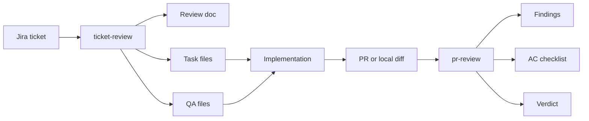
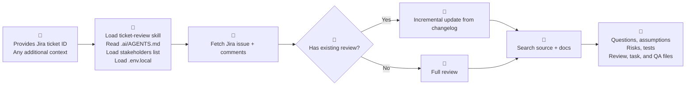
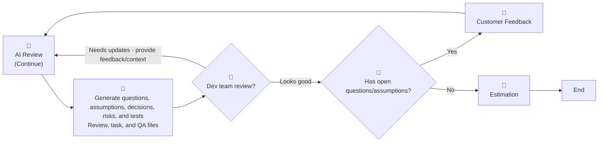
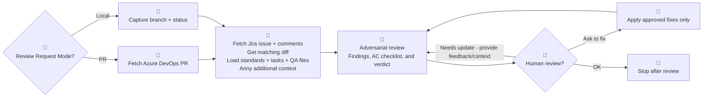
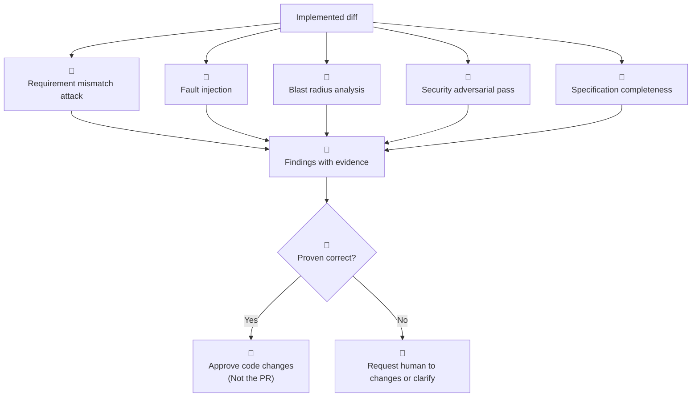

# AI Workflow Demo

## Ticket Review to PR Review

From Jira planning to adversarial merge review for Dev, QA, and technical management.

<div class="pt-10 opacity-80">
Tuyen Pham - June 2026
</div>

<!--
Frame this as a two-part workflow. Ticket-review plans the work. PR-review challenges the completed work.
-->

---
layout: image-right
image: /assets/images/why.avif
---

# Why This Demo Exists

The team already understands applied AI.

Today focuses on two codebase-specific skills:

- `ticket-review`: turns Jira context into repo-grounded implementation and QA tasks
- `pr-review`: challenges a PR or local diff before merge
- both use remote context, local source, and repository standards
- both produce artifacts or findings that humans can verify

<!--
Do not sell AI generally. This audience wants operational trust: sources, constraints, outputs, and where human judgment remains.
-->

---
layout: center
class: text-center
---

# End-To-End Flow



The handoff matters: `ticket-review` defines intent; `pr-review` verifies the evidence.

<!--
This slide sets the whole mental model before going into details.
-->

---
layout: section
---

# Part 1

## `ticket-review`

Plan before code.

---
layout: two-cols-header
layoutClass: gap-12
---

# `ticket-review` Mental Model

::left::

`ticket-review` is the ARCHITECT planning layer.

It answers:

- what must change?
- where will it likely change?
- what needs testing?
- what is unclear?
- what docs must stay current?

::right::

## Outputs

- `docs/src/tickets/<ticket>-review.md`
- `.ai/tasks/<branch-slug>/*.md`
- `.ai/tasks/<branch-slug>/*.qa.md`
- `.ai/memory/*-context.md` for EPIC work

<!--
The audience should understand that this skill does not implement the feature.
-->

---
layout: center
class: text-center
---

# Ticket Review Workflow

From ticket requirement and existing code



Refine process



<!--
Walk this slowly. The key is: no jump from ticket text straight to implementation.
-->

---
layout: two-cols-header
---

# What Ticket Review Extracts

::left::

## From Jira

- acceptance criteria
- expected behavior
- test data
- edge cases
- constraints
- comments and decisions
- referenced PRs or branches

::right::

## From the Repo

- likely models and services
- controller/API entry points
- frontend/widget impact
- integration boundaries
- test placement
- documentation updates

<!--
This slide is where QA and managers see why ticket-review helps before estimation.
-->

---

# Ticket Review Artifacts

The main review document:

```text
docs/src/tickets/<TICKET-ID>-review.md
```

It contains:

1. Questions, Assumptions & Decisions
2. Proposed Implementation
3. Detailed Task List
4. QA Verification Notes
5. Risks & Concerns

Every review includes `Last Reviewed` so re-review can use Jira changelog and comments.

<!--
Open a real generated review doc during the live demo if available.
-->

---
layout: two-cols-header
---

# Tasks and QA Files

For STANDARD and EPIC work:

```text
.ai/tasks/<branch-slug>/<NNN-name>.md
.ai/tasks/<branch-slug>/<NNN-name>.qa.md
```

::left::

## Developer Receives

- context files
- goal from acceptance criteria
- implementation steps
- completion checklist
- documentation update section

::right::

## QA Receives

- affected features
- happy paths
- edge cases
- regression checks
- test data requirements

<!--
Mention QA mode is task in this repo.
-->

---

# Ticket Review Demo Prompt

```text
Use the ticket-review skill for https://my-organization.atlassian.net/browse/JIRA-934.
Extra context: QA asked us to pay special attention to regression around saved baskets.
```

Live demo beats:

1. show credential check
2. show Jira issue and comments fetch
3. show existing review/task check
4. show codebase search
5. open review document
6. open task and QA files

<!--
If credentials are missing, use it as a guardrail demo rather than treating it as failure.
-->

---
layout: section
---

# Part 2

## `pr-review`

Attack after code.

---
layout: two-cols-header
---

# `pr-review` Mental Model

`pr-review` reviews completed or in-progress changes.

::left::

It asks:

- does this actually satisfy Jira?
- can this break under bad input?
- are callers and contracts still safe?
- are tests in the right place?
- are documentation and completion criteria finished?

::right::

Review targets:

- Azure DevOps PR
- local branch diff
- staged changes
- unstaged changes
- full worktree

<!--
This is not just a summary of the PR. It is an evidence-driven challenge.
-->

---
layout: center
class: text-center
---

# PR Review Workflow



The review session should use a different AI model than the one that implemented the code.

Developers can self-run AI review sessions before other human review begins.

<!--
Stress that fixes are suggested first. The user decides what gets applied.
-->

---

# PR Review Inputs

| Input         | Why It Matters                                    |
| ------------- | ------------------------------------------------- |
| review mode   | PR review or local pre-PR review                  |
| PR URL        | source, target, author, remote metadata           |
| local scope   | branch diff, staged, unstaged, or full worktree   |
| Jira ticket   | requirements and acceptance criteria              |
| extra context | verbal decisions or architectural notes           |
| base branch   | defaults to `develop`; differences are called out |

The skill must not silently resume old review state.

<!--
This mirrors the skill: always gather input first.
-->

---
layout: center
class: text-center
---

# Adversarial Mindset

<div class="text-3xl leading-12 pt-8">
The job is to break the code,<br />not confirm it works.
</div>

<div class="pt-8 opacity-80">
Assume every change contains at least one latent defect until evidence proves otherwise.
</div>

<!--
This is the key pr-review slide. Pause here.
-->

---
layout: center
class: text-center
---

# Adversarial Review Phases



<!--
Explain that this is protective, not hostile. It protects users and production behavior.
-->

---
layout: two-cols-header
---

# How The Reviewer Attacks

::left::

## Requirement Attack

- acceptance criteria covered in name only?
- latest Jira comment ignored?
- silent no-op possible?
- implemented behavior not requested?

## Fault Injection

- null or empty input
- boundary values
- external failures
- unexpected ordering

::right::

## Blast Radius

- callers updated?
- contracts changed?
- DI/routes/config aligned?
- views or JSON consumers safe?

## Security

- injection
- authz/authn
- IDOR
- info leakage

<!--
Use one concrete example from the chosen PR during the demo.
-->

---

# PR Review Demo Prompt

Remote PR review:

```text
Use the pr-review skill for https://my-organization.visualstudio.com/my-project/_git/my-repo/pullrequest/123.
Ticket: https://my-organization.atlassian.net/browse/JIRA-934.
Base branch: develop.
```

Local pre-PR review:

```text
Use the pr-review skill to review my current branch against develop.
Scope: full worktree.
Ticket: JIRA-934.
```

<!--
Run this after showing the ticket-review artifacts. That makes the continuity obvious.
-->

---
layout: two-cols-header
---

# Real-world Feedback

::left::

## Works Well

- stronger ticket refinement
- faster implementation once context is loaded
- higher code quality bar
- clearer understanding of existing and undocumented behavior

::right::

## Tradeoff

- slower start while the review gathers context

---
layout: center
class: text-center
---

# Demo Takeaway

<div class="text-3xl leading-12 pt-8">
`ticket-review` creates the plan.<br />
`pr-review` tries to break the result.
</div>

<div class="pt-8 opacity-80">
Together, they make AI-assisted delivery more grounded, testable, and reviewable.
</div>

<!--
End here, then move into live prompts or Q&A.
-->
